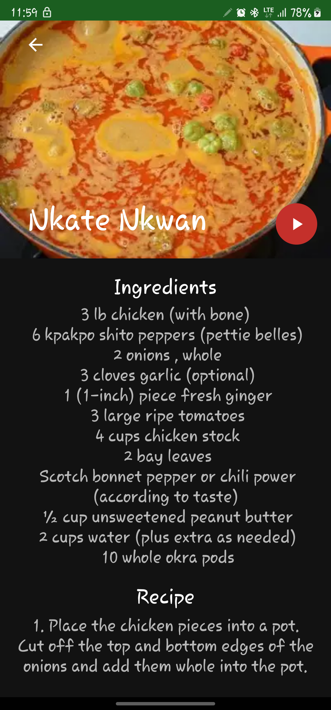

# Reciplan

Reciplan is an offline-first native android app to help you discover and prepare delicious Ghanaian dishes.
Reciplan2 provides everything you need to explore the rich flavors and traditions of Ghanaian cuisine.
The codebase is simple to facilitate easy understanding by beginners.

## Table of contents

1. [Demo](#demo)
2. [Screenshots](#screenshots)
3. [Tech Stack](#tech-stack)
4. [Features](#features)
5. [Development Setup](#development-setup)
6. [License](#license)

## Demo

https://github.com/keeghan/MovieSearch/assets/40280581/fb75ae08-1c01-462a-ba55-b79cf039d156

## Screenshots

 &nbsp;  &nbsp;  
 &nbsp;  &nbsp;  

## Tech Stack

- [Kotlin](https://kotlinlang.org/) as sole Language.
- [Kotlin Coroutines](https://kotlinlang.org/docs/reference/coroutines/coroutines-guide.html) for threading.
- [Room Database](https://developer.android.com/training/data-storage/room) for local data storage.
- [Glide](https://github.com/bumptech/glide) for image loading and caching.
- [Preference](https://developer.android.com/reference/android/preference/Preference) for persisting user configurations.
- [Ucrop](https://github.com/Yalantis/uCrop) for flexible image cropping experience.
- [Kotlinx Serialization](https://kotlinlang.org/docs/serialization.html) for JSON serialization.
- [Swipedecorator](https://github.com/xabaras/RecyclerViewSwipeDecorator) for decorating RecyclerView with swipe actions.
- [Ssp & Sdp](https://developer.android.com/reference/android/preference/Preference) for maintaining scalable size Unit.

## Features

- Design a weekly meal plan
- Add, Edit and Remove a collection of Ghanaian recipes
- Export and Import local recipes as Json files.
- Support for dark theme

## Development Setup

Make sure you have downloaded and setup the Android Studio SDK correctly before you begin on this project. Here is the
Android Studio documentation to guide you through
it: [Android Studio Setup](http://developer.android.com/sdk/installing/index.html?pkg=studio)

## License

This project is currently licensed under the Creative Commons Legal Code : CC0 1.0 Universal

